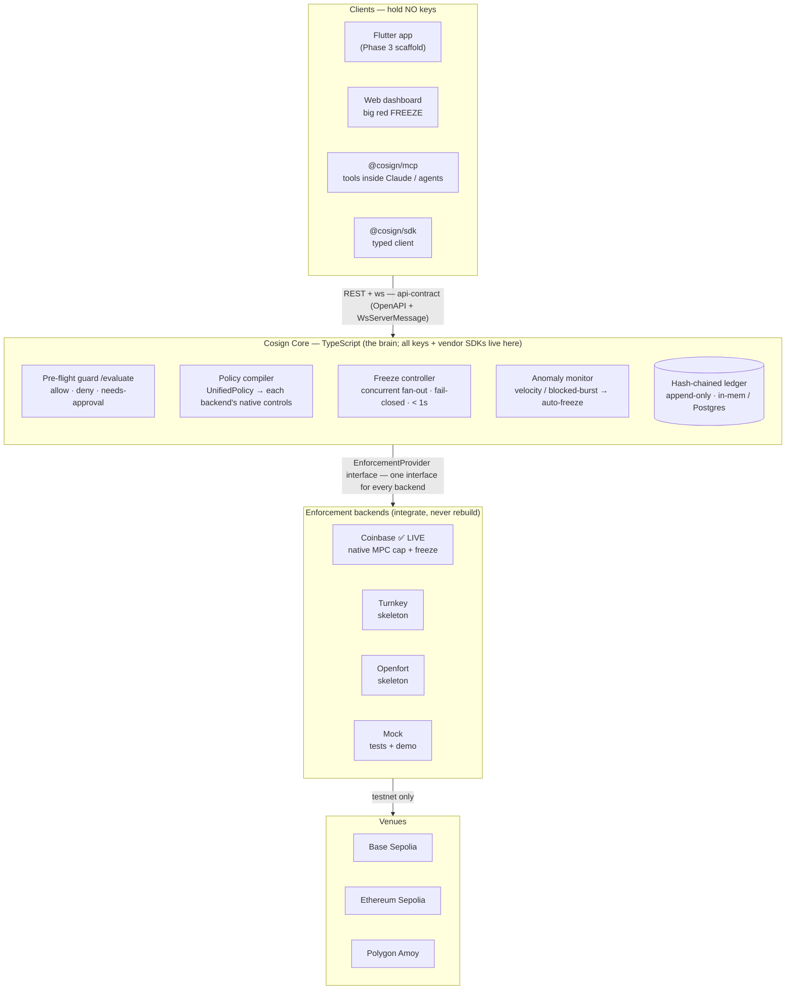
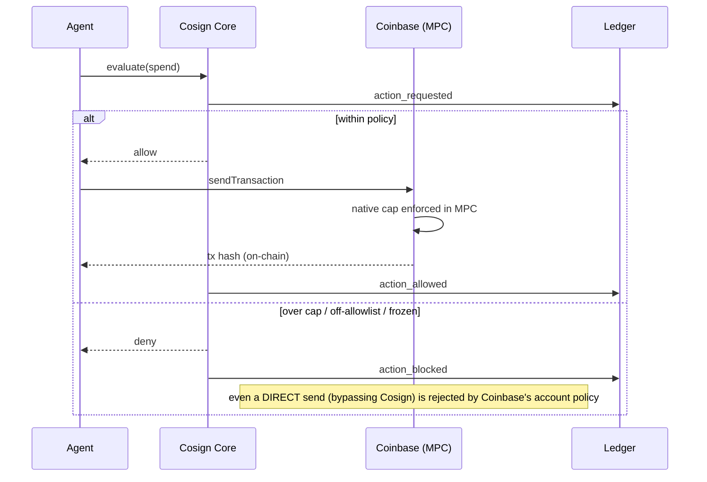

# Cosign — Architecture

The language boundary (Dart client / TypeScript Core) is the **trust boundary**: clients hold no
keys and can only call the API, so a compromised client still can't move funds or weaken policy.
All crypto/vendor-SDK weight lives in Core. The moat is the neutral layer **above** the wallets —
one policy, one freeze, one audit ledger across every backend at once.

## System



## Flow 1 — an agent spends (guard + native enforcement)



## Flow 2 — the kill switch (cross-vendor freeze, fail-closed)

```mermaid
sequenceDiagram
  participant O as Operator / Anomaly monitor
  participant C as Freeze controller
  participant P as Providers (x N)
  participant L as Ledger
  O->>C: freeze all
  C->>L: freeze_requested
  C->>P: freeze() — concurrent, bounded by timeout
  alt confirmed
    P-->>C: confirmed
    C->>L: freeze_result + freeze_resolved (&lt; 1s)
  else unconfirmed / timeout
    C->>P: revokeSession (escalate — harder kill)
    C->>L: escalation_revoke_session
    C->>L: still_dangerous (only if it still can't be confirmed)
  end
```

## Packages

| Package | Role |
|---|---|
| `api-contract` | OpenAPI + ws schema + `CosignApi` — single source of truth (generates the Dart client) |
| `core` | `EnforcementProvider` interface, branded ids, money, event vocabulary, **freeze controller** |
| `policy` | `UnifiedPolicy` + the **compiler** → Coinbase / Turnkey / Openfort native shapes |
| `ledger` | `LedgerPort` + InMemory / pglite / **Postgres**; DB-agnostic hash chain |
| `providers/*` | adapters: **coinbase** (live), turnkey, openfort (skeletons), mock |
| `api` | `CosignCore` (brain) + REST/ws server + web dashboard + embedded adapter |
| `sdk` | typed client over the Core API (the TS twin of the Dart client) |
| `mcp` | Cosign as MCP tools (kill switch + spend guard inside any MCP client) |
| `x402` | governs x402 machine-payments (guard a payment before it pays) |
| `agent-harness` | reference agents + the headline demo |

## Deployment

Core runs as a container (`Dockerfile`) — **live** at `https://cosign-b7ru.onrender.com` (Render,
Docker). `DATABASE_URL` → durable Postgres ledger; absent → in-memory. Host-agnostic (std Node +
std Postgres), so Fly / Akash / self-host are drop-in.
